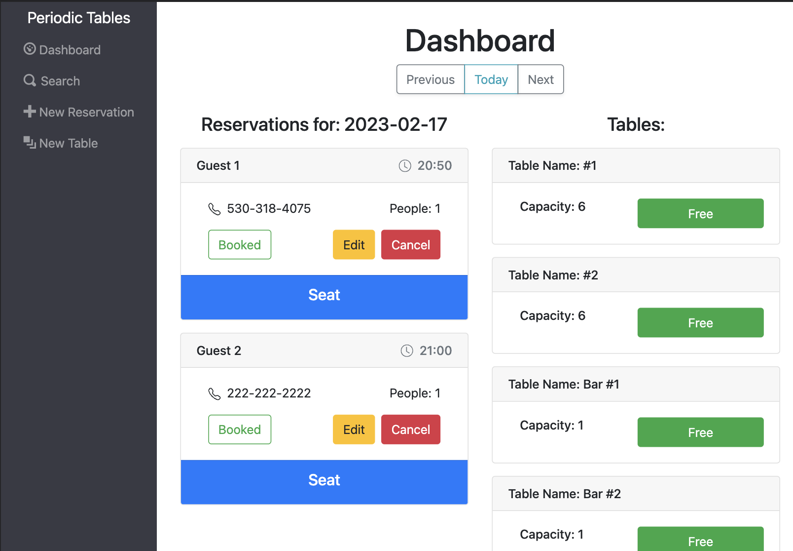

# Thinkful Capstone: Restaurant Reservation System

Backend Link (Render Web Service): https://thinkful-final-capstone-restaurant.onrender.com

Frontend Link (Render Static Site): https://thinkful-final-capstone-restaurant-mmz6.onrender.com

## Summary
This React.js application, built using a inside-out approach (backend first, then frontend), is a simple and effective resaurant reservation managment tool. An employee using this software can easily create, edit, and keep track of seating for reservations made at the establishment. A user can also manage tables that the restaurant has available for seating, as well as thier status and capacity. Finally, a user can search for any reservation stored in the database by phone number, whether that reservation is booked, seated, finished, or cancelled. With Periodic Tables, your customers will be happy with the efficiency and efficacy of your venue's operations.

## Technology Used
This app makes use of the following:
- React.js
- Bootstrap CSS
- Node
- Express
- PostgreSQL API

## To install and run locally on your machine:

1. Fork and clone this repository.
1. Run `npm install`.
1. Run `npm start`.
1. You should not need to make changes to any files, simply view the application in your browser.
